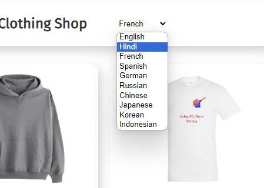
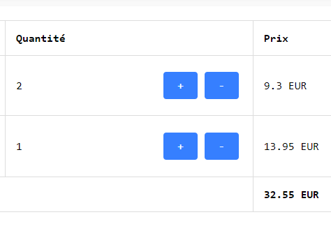
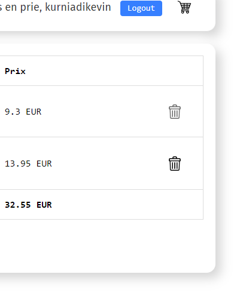
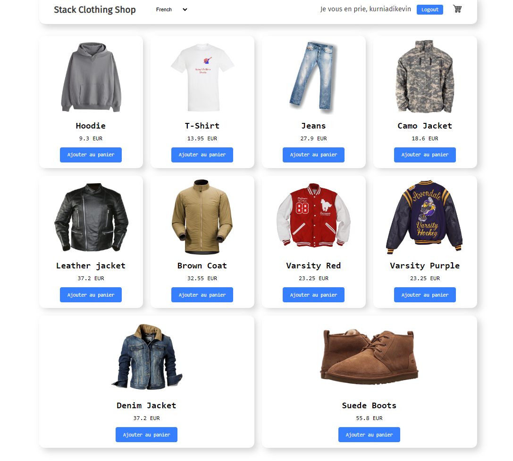
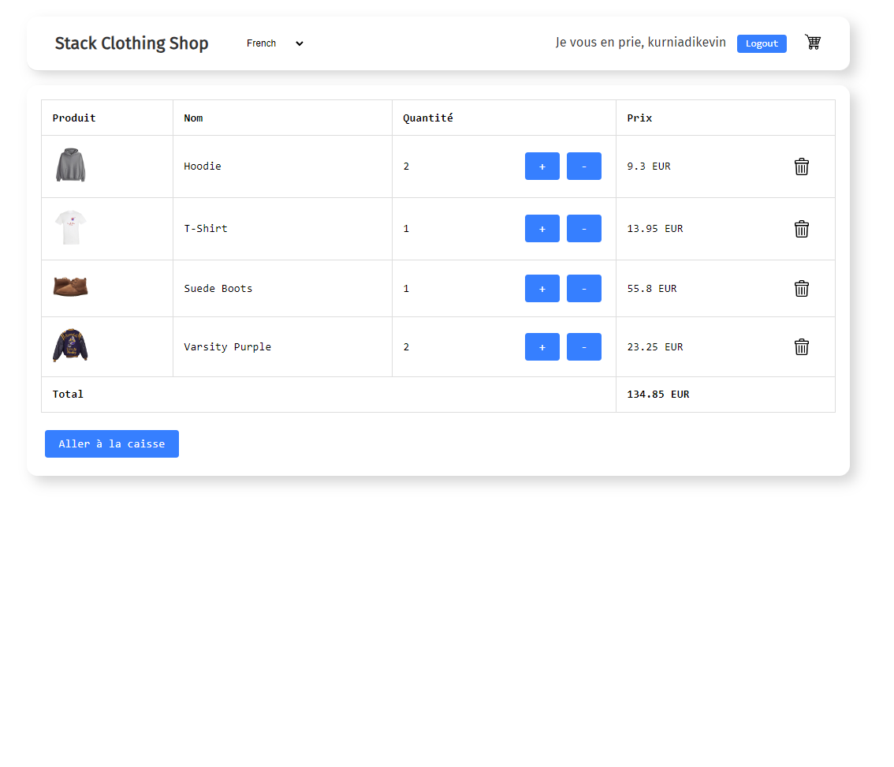

# Stackup Affinidi Capstone Write Up

## Title: Enhancing User Experience: A React.js Clothing Store with Multilingual and Currency Support

### Introduction:
In diverse global language and currency support an online store need to include variety language and currency conversion support too. This write up explore the development and implementation of that feature, showcasing how the integration of multilingual and multi currency support significantly enhances user experience and accessibility. This feature build upon the Affinidi Capstone login feature that allow the website to detect user currency and language based on user country info.

### Project Overview:
This project is based on Affinidi-Capstone with some improvement on multilingual and multicurrency with some of minor user interface improvement on how user access item in cart and additional product that available

# Key Feature:

## 1. Multilingual Support:

- The one of main feature that added is multilingual support with Affinidi Login the store can get user country origin. This data will automatically change the language of website as long as user on scope of 18 countries that available this include  America, Australia, Canada, Ireland, New Zealand, United Kingdom, Singapore, China,Taiwan, Hongkong, France, Germany, India, Indonesia, Russia, Spain, Japan, South Korea. 

- If user use other name of country than the 18 countries above on Affinidi user still can switch language on dashboard/ header of the website. This language selection support 10 language including English, Chinese (Traditional), French, Germany, Indonesian, Russian, Spanish, Hindi, Japanese, and Korean. ( You can see the list of country on ```countryCode``` object at ```./src/locales/languageCodeList.js``` file )

### User interface:
- 

### How it work: 

- **Switching Language:** For this feature i'm using ```useTransaltion``` from ```react-i18next``` library to switch transalation selection on Header component you can find it at ```./src/components/Header.js``` this will allow to switch the placeholder of language that i use to subtitute language set using ```i18n.changeLanguage()``` function. The set of language data is stored on ```./src/locales``` folders there is 10 different set of language folder that named by language code **For example: ('en', 'frnc', 'jpn',...etc)** that contain all file named ```transaltion.json```. This data then called on ```./src/i18n.js``` for i18t initiallization and specify default language as **'en' (English)**.

- **Automatically Change Language and Currency:** The file ```./src/locales/languageCodeList.js``` contain ```countryCode``` object that use for detect which language user can use based on their country data the other object called ```countryConversion``` allow each language to have each currency conversions.

## 2. Multicurrency Support: 
- This main feature allow user change currency automatically based on language they use. The store price data is in USD and than based on user language of choice convert the value to other currency to display on website. 

### User interface
- **This feature have no interface, instead sync with language selection on page.**

### How it work: 

- Everytime user log-in the website store session-data of user language code. This language code data then use to find currency that user gonna use from ```./src/locales/languageCodeList.js``` on ```countryConversion``` object and then use the value as multiplier on default USD price.

- The value then store on ```conversion``` variable in both ```ProductDisplay``` and ```Cart``` component. This ```conversion``` value than use for multiplier value to display price based on currency that currently use as this formula :
 ```product.price( default price in USD ) * conversion(multiplier value)```


## 3. Dynamic Cart Support:
-  When user added product to cart user can adjust quantity on /cart page. If user increase quantity of the product the total price will be adjusted and so does when user decrease it. 
This feature also allow user to automatically delete item from cart if user adjust quantity to zero, making the product of choice remove from cart at all.

## User interface:

  ### Adjust quantity
-  

- The '+' button handling event ```addToCart()``` function
- The '-' button handling event ```removeOneFromCart()``` function


### Remove item
- 

- The 'trash can' icon handling event ```removeItemById()``` function
### How it work:

- I added function ```removeOneFromCart()``` and ```removeItemById()``` that declared on ```./src/App.js``` then later passed on ```Cart``` component. 

-  ```removeOneFromCart()``` work as function to decrease quantity of product by one in ```Cart``` component this function also remove item if quantity is zero automatically (if user decrease quantity from 1 to 0).

- ```removeItemById()``` remove item on cart despite the quantity of item 
on cart page

- ```addToCart()``` function from default project is modified with parameter for choose to show pop-up modal or not.


## 4. Styling Component:
- The website now using box shadow on component to make page look more clean. Font-family also changed to monospace and Fira-Sans on Header component. This styling affected ```Header``` , ```ProductDisplay```, and ```Cart``` component

## 5. Include More Product:
-  The store now display 7 more products making total of 10 products to display on variety of prices. By add more image file on ```./public``` folder and add ```id, name, price``` data on ```products``` array in ```./src/components/ProductDisplay.js``` file.

## Screenshots
- ## Main page:
- 
- ## Cart page: 
- 